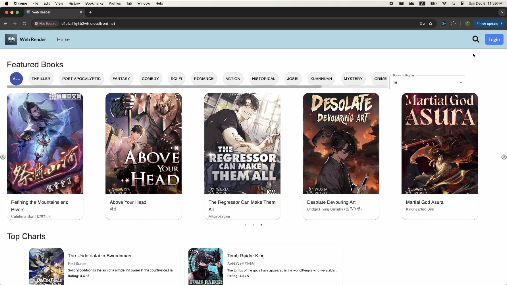

# AI-Powered Book Reader

[](https://reactjs.org/)
[](https://www.djangoproject.com/)
[](https://aws.amazon.com/)
[](https://en.wikipedia.org/wiki/Artificial_intelligence)

> An intelligent, AI-powered book reading application that transforms the digital reading experience through advanced natural language processing, text-to-speech, text-to-image generation, and chapter summarization capabilities.

## 📖 Table of Contents

- [Overview](#overview)
- [Features](#features)
- [Architecture](#architecture)
- [Technology Stack](#technology-stack)
- [API Documentation](#api-documentation)
- [Installation](#installation)
- [Usage](#usage)
- [Testing](#testing)
- [Deployment](#deployment)
- [Contributing](#contributing)
- [Team](#team)

## 🎯 Overview

The AI-Powered Book Reader is a cutting-edge application designed to bridge the gap between traditional digital reading and modern AI capabilities. Built as part of CMPE 273 - Enterprise Distributed Systems, this platform leverages Large Language Models (LLMs) to provide an enhanced, accessible, and interactive reading experience.

### Key Objectives

- **Enhanced Accessibility**: Make reading accessible for visually impaired users through AI-driven features
- **Real-Time NLP**: Implement LLMs for instant text processing and comprehension
- **Open-Source Integration**: Seamless access to vast literature collections
- **Intuitive Interface**: User-friendly design with personalized reading experiences
- **AI-Powered Features**: Text-to-speech, text-to-image, and intelligent summarization

## ✨ Features

### 🤖 AI-Powered Capabilities

- **Text-to-Speech (TTS)**: Convert text to natural-sounding speech using Microsoft Edge TTS
- **Text-to-Image (TTI)**: Generate AI-powered visual representations using Amazon SageMaker Dreamlike Diffusion
- **Chapter Summarization**: Automated chapter summaries using DistilBART CNN 6-6 model
- **Real-Time Processing**: Instant AI model responses for enhanced user experience

### 📚 Content Management

- **Multi-Source Integration**: Access books from Project Gutenberg (Gutendex API) and WuxiaWorld
- **Personal Library**: Create custom reading lists and organize books by preferences
- **Reading Progress**: Track reading history and bookmark favorite passages
- **Review System**: Rate and review books with community feedback

### 🔐 Authentication & Security

- **Custom Authentication**: Secure email/password registration and login
- **Google OAuth2**: Seamless integration with Google accounts
- **Secure Storage**: Encrypted credential management and session handling

### 🎨 User Experience

- **Responsive Design**: Optimized for desktop, tablet, and mobile devices
- **Customizable Interface**: Adjustable fonts, themes, and reading preferences
- **Offline Support**: Client-side caching for uninterrupted reading
- **Accessibility Features**: High contrast modes, adjustable text sizes, and screen reader support

## 📸 Demo Images

Here are some screenshots of the application:

### **Main Page**


### **Single Book Search**


### **Review Page**


### **Library Page**


### **Reading Page – Text to Speech**


### **Reading Page – Text to Image**


### **Reading Page – Customization**


---

## 🎥 Demo Video

Watch the demo here:  
[](https://drive.google.com/file/d/14FKU8VqZIHQvHOYBXDzuwVMzam-QA_Y7/view?usp=drive_link)


## 🏗️ System Architecture


*(High-level architecture of the system)*

---

## 🔄 Data Flow


*(End-to-end data flow from input sources to analytics and output)*


## 🛠️ Technology Stack

### Frontend

- **React 18**: Modern UI framework with hooks and context
- **Tailwind CSS**: Utility-first CSS framework for responsive design
- **IndexedDB**: Client-side database for offline functionality
- **Webpack**: Module bundler and build tool

### Backend

- **Django 4.0+**: Python web framework with REST API support
- **Django REST Framework**: API development toolkit
- **Celery**: Asynchronous task processing
- **Redis**: In-memory data structure store for caching

### AI & Machine Learning

- **Amazon SageMaker**: Managed ML platform for model deployment
- **Edge TTS**: Microsoft's text-to-speech service integration
- **Dreamlike Diffusion 1.0**: Text-to-image generation model
- **DistilBART CNN 6-6**: Text summarization model

### Infrastructure

- **AWS ECS**: Container orchestration service
- **AWS RDS**: Managed MySQL database
- **AWS S3**: Object storage for static files
- **AWS CloudFront**: Content delivery network
- **AWS Application Load Balancer**: Traffic distribution

## 📡 API Documentation

### Authentication APIs

| Endpoint              | Method | Parameters                                                                                 | Description             | Response                                                                  |
| --------------------- | ------ | ------------------------------------------------------------------------------------------ | ----------------------- | ------------------------------------------------------------------------- |
| `/auth/signup/`       | POST   | `{"email": "string", "password": "string", "first_name": "string", "last_name": "string"}` | Register new user       | `{"response.data": true/false, "response.message": "string"}`             |
| `/auth/login/`        | POST   | `{"email": "string", "password": "string"}`                                                | User authentication     | `{"access": "string", "refresh": "string", "response.message": "string"}` |
| `/auth/google-login/` | POST   | `{"token": "string"}`                                                                      | Google OAuth validation | `{"access": "string", "refresh": "string", "response.message": "string"}` |

### Book Management APIs

| Endpoint                             | Method | Parameters                                                            | Description               | Response               |
| ------------------------------------ | ------ | --------------------------------------------------------------------- | ------------------------- | ---------------------- |
| `/main/books/with-genres/`           | GET    | None                                                                  | Get all books with genres | List of book objects   |
| `/main/books/with-genres/<book_id>/` | GET    | `book_id` (path)                                                      | Get specific book details | Book object            |
| `/main/books/with-genres/search/`    | GET    | `query=<keyword>`                                                     | Search books by keyword   | List of matching books |
| `/main/reviews/`                     | POST   | `{"book_id": int, "user_id": int, "review": "string", "rating": int}` | Add book review           | Success/error message  |

### Library Management APIs

| Endpoint                           | Method | Parameters                                                       | Description             | Response                              |
| ---------------------------------- | ------ | ---------------------------------------------------------------- | ----------------------- | ------------------------------------- |
| `/library/get_library_data/`       | GET    | `user_id`                                                        | Get user's library data | Library object with books and shelves |
| `/library/get_shelf_list/`         | GET    | `user_id`                                                        | Get user's shelf list   | List of shelf objects                 |
| `/library/add_shelf/`              | POST   | `{"user_id": int, "shelf": {"shelf_id": int, "name": "string"}}` | Create new shelf        | Success/error message                 |
| `/library/add_book_to_shelf/`      | POST   | `{"user_id": int, "shelf_id": int, "book_id": int}`              | Add book to shelf       | Success/error message                 |
| `/library/remove_book_from_shelf/` | DELETE | `{"shelf_id": int, "book_id": int}`                              | Remove book from shelf  | Success/error message                 |

### Reading & AI APIs

| Endpoint                                   | Method | Parameters                                | Description         | Response                                |
| ------------------------------------------ | ------ | ----------------------------------------- | ------------------- | --------------------------------------- |
| `/book/{book_id}/{chapter_number}`         | GET    | `book_id`, `chapter_number` (path)        | Get chapter content | Chapter content object                  |
| `/book/tts/{book_id}/{chapter_number}`     | POST   | `{"chapter_number": int, "book_id": int}` | Stream TTS audio    | Streaming audio URL and paragraph index |
| `/book/aiimage/{book_id}/{chapter_number}` | POST   | `{"chapter_number": int, "book_id": int}` | Generate AI images  | JSON with AI-generated chapter images   |

## 🚀 Installation

### Prerequisites

- Node.js 18+ and npm
- Python 3.8+
- Redis server
- MySQL database
- MongoDB instance

### Frontend Setup

1. **Clone the repository**

   ```bash
   git clone https://github.com/DJJ547/CMPE273-Book-Reader-React.git
   cd cmpe273-book-reader-react
   ```

2. **Install dependencies**

   ```bash
   npm install
   ```

3. **Environment Configuration**

   - Download the `.env` file from the provided link
   - Place it in the root directory
   - Configure your API endpoints and authentication keys

4. **Start development server**
   ```bash
   npm start
   ```

### Backend Setup

1. **Clone the backend repository**

   ```bash
   git clone https://github.com/DJJ547/CMPE273-Book-Reader-Django.git
   cd cmpe273-book-reader-django
   ```

2. **Install Python dependencies**

   ```bash
   pip install -r requirements.txt
   ```

3. **Configure database connections**

   - Update database settings in `settings.py`
   - Configure Redis connection
   - Set up AWS credentials for SageMaker

4. **Run migrations**

   ```bash
   python manage.py migrate
   ```

5. **Start the server**
   ```bash
   python manage.py runserver
   ```

## 📱 Usage

### Getting Started

1. **Authentication**: Sign up with email/password or use Google OAuth
2. **Browse Books**: Explore trending books and new releases on the main page
3. **Search**: Use the search functionality to find specific books or genres
4. **Reading**: Open any book to access AI-powered reading features
5. **Library Management**: Organize books into custom shelves and track reading progress

### AI Features

- **Text-to-Speech**: Click the TTS button to have the book read aloud
- **Text-to-Image**: Generate visual representations of chapter content
- **Summarization**: Get AI-generated chapter summaries for quick understanding

## 🧪 Testing

### Frontend Testing

```bash
npm test
```

### Backend Testing

```bash
python -m pytest
```

### Load Testing

- **JMeter**: Configured for up to 200 concurrent users
- **Performance**: Optimized for sub-2000ms response times

## 🚀 Deployment

### Frontend Deployment

- **AWS S3**: Static file hosting
- **AWS CloudFront**: Content delivery network
- **CI/CD**: Automated deployment pipeline

### Backend Deployment

- **AWS ECS**: Container orchestration
- **AWS Application Load Balancer**: Traffic distribution
- **AWS RDS**: Managed MySQL database
- **AWS EC2**: MongoDB hosting

### AI Services

- **AWS SageMaker**: Model deployment and inference
- **AWS Lambda**: Serverless AI processing
- **API Gateway**: RESTful API management

## 🤝 Contributing

1. Fork the repository
2. Create a feature branch (`git checkout -b feature/amazing-feature`)
3. Commit your changes (`git commit -m 'Add amazing feature'`)
4. Push to the branch (`git push origin feature/amazing-feature`)
5. Open a Pull Request

## 👥 Team

**CMPE 273 - Enterprise Distributed Systems**

- **Jiajian Liu** - Frontend Development & UI/UX
- **Yifu Fang** - Backend Development & API Design
- **Dina Liao** - AI Integration & Machine Learning
- **Jiajun Dai** - Infrastructure & DevOps

## 📄 License

This project is developed as part of CMPE 273 coursework at San José State University.

## 🔗 Links

- **Frontend Repository**: [https://github.com/DJJ547/CMPE273-Book-Reader-React.git](https://github.com/DJJ547/CMPE273-Book-Reader-React.git)
- **Backend Repository**: [https://github.com/DJJ547/CMPE273-Book-Reader-Django.git](https://github.com/DJJ547/CMPE273-Book-Reader-Django.git)
- **Course**: CMPE 273 - Enterprise Distributed Systems
- **Instructor**: Dr. Chandrasekar Vuppalapati

---

<div align="center">
  <p>Built with ❤️ by the CMPE 273 Team</p>
  <p>Fall 2024 • San José State University</p>
</div>
